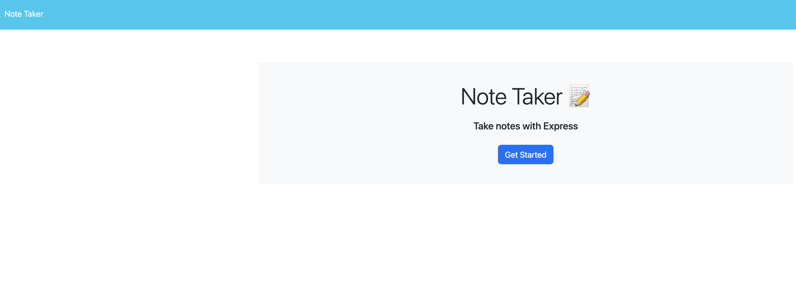
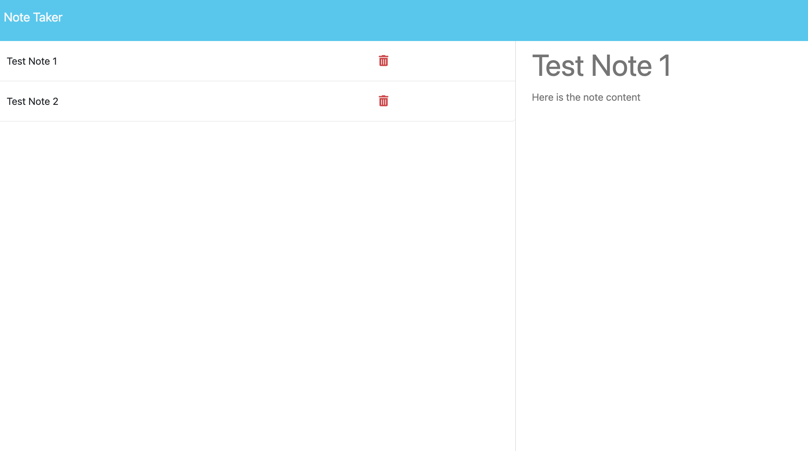

# Phils Note Taker App
  
  
  
  ## Description
  A NodeJS app that uses express, express routes and HTML to create notes, read existing notes and delete notes that are stored in a JSON file.
  
  ## Table of Contents
- [Phils Note Taker App](#phils-note-taker-app)
  - [Description](#description)
  - [Table of Contents](#table-of-contents)
  - [Installation](#installation)
  - [Usage](#usage)
  - [Dependencies](#dependencies)
  - [Live URL](#live-url)
  - [License](#license)
  - [Contributing](#contributing)
  - [Questions](#questions)
  
  ## Installation
  npm install 
  
  ## Usage
  node server.js and open localhost:PORT (default is 3000)
  
  ## Dependencies
  - UUID
  - FS
  - Express

  ## Live URL
  
  
  Live URL Link: https://phils-notetaker-app-module11-4fe31ed14102.herokuapp.com/

  ## License
  This application is covered under the [MIT](https://choosealicense.com/licenses/mit/) license.
  
  ## Contributing
  Contributors:
  - https://github.com/Xandromus
  ## Questions
  For more information, check out my GitHub profile: [@phillipkujawa](https://github.com/phillipkujawa)
  
  If you have any additional questions, please send an email to: phillip.kujawa@me.com
